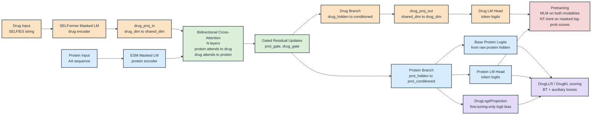

# LogiCL Current Architecture

```mermaid
flowchart LR
    accTitle: LogiCL Current Architecture
    accDescr: Dual-encoder conditional masked language model with bidirectional cross-attention, logit-space pretraining, and a DrugLogitProjection fine-tuning head.

    prot_in["Protein Input<br/>AA sequence"]
    drug_in["Drug Input<br/>SELFIES string"]

    esm["ESM Masked LM<br/>protein encoder"]
    sel["SELFormer Masked LM<br/>drug encoder"]
    proj_in["drug_proj_in<br/>drug_dim to shared_dim"]

    cross["Bidirectional Cross-Attention<br/>N layers<br/>protein attends to drug<br/>drug attends to protein"]
    gates["Gated Residual Updates<br/>prot_gate, drug_gate"]

    prot_branch["Protein Branch<br/>prot_hidden to prot_conditioned"]
    drug_branch["Drug Branch<br/>drug_hidden to conditioned"]
    proj_out["drug_proj_out<br/>shared_dim to drug_dim"]

    prot_head["Protein LM Head<br/>token logits"]
    drug_head["Drug LM Head<br/>token logits"]
    base_head["Base Protein Logits<br/>from raw protein hidden"]

    pretrain["Pretraining<br/>MLM on both modalities<br/>NT-Xent on masked log-prob scores"]
    dlp["DrugLogitProjection<br/>fine-tuning-only logit bias"]
    scoring["DrugLLR / DrugKL scoring<br/>BT + auxiliary losses"]

    prot_in --> esm
    drug_in --> sel
    sel --> proj_in
    esm --> cross
    proj_in --> cross
    cross --> gates
    gates --> prot_branch
    gates --> drug_branch
    prot_branch --> prot_head
    prot_branch --> base_head
    drug_branch --> proj_out
    proj_out --> drug_head
    prot_head --> pretrain
    drug_head --> pretrain
    prot_branch --> dlp
    dlp --> scoring
    prot_head --> scoring
    base_head --> scoring

    classDef protein fill:#D7ECFF,stroke:#2E4049,stroke-width:2px,color:#203038
    classDef drug fill:#FCE3C4,stroke:#2E4049,stroke-width:2px,color:#203038
    classDef core fill:#DCEFD9,stroke:#2E4049,stroke-width:2px,color:#203038
    classDef logic fill:#F6D7D8,stroke:#2E4049,stroke-width:2px,color:#203038
    classDef fine fill:#E3DBF7,stroke:#2E4049,stroke-width:2px,color:#203038

    class prot_in,esm,prot_branch,prot_head,base_head protein
    class drug_in,sel,proj_in,proj_out,drug_branch,drug_head drug
    class cross,gates core
    class pretrain logic
    class dlp,scoring fine
```
